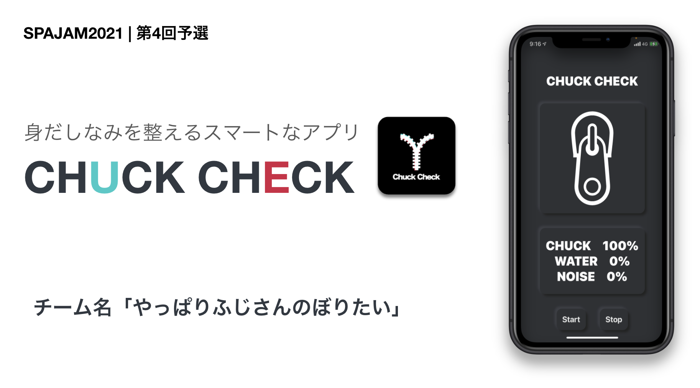
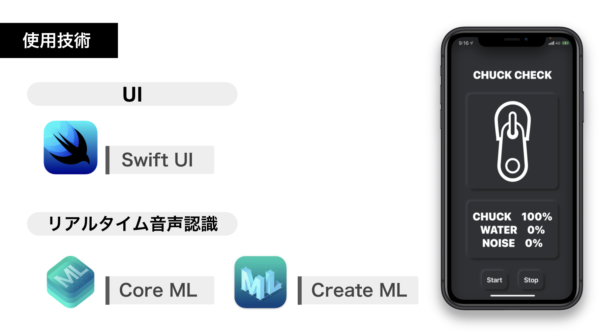

# CHUCK CHECK
[SAJAM2021](https://www.spajam.jp/result?id=4)第4回予選で開発．11チームの中で最優秀賞をいただきました．

# 使い方

1. アプリが実行している状態でズボンのポケットに入れる
2. アプリ内の音声認識で状態を以下の3クラスで識別  
    1. チャックが動いてる
    2. 水が流れている
    3. 何もなし
3. 識別結果の時系列処理によって，チャックが開きっぱなしかを判断しユーザに通知

# 使用技術
